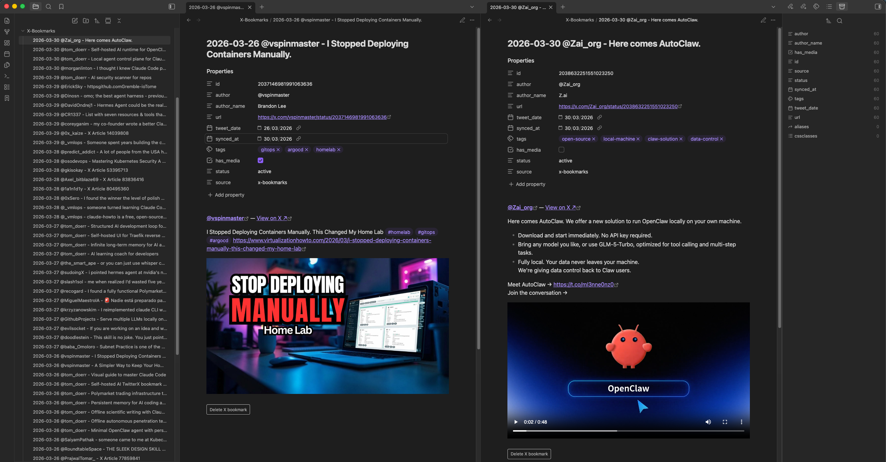

# X Bookmarks for Obsidian

Sync your X (Twitter) bookmarks into your Obsidian vault as individual Markdown notes — with AI-powered tagging via local LLMs (LM Studio, llama.cpp).



## Features

- **Incremental sync** — only imports new bookmarks each run; picks up where it left off
- **Delete from Obsidian** — remove a bookmark from X via inline button or command palette, note is archived automatically
- **AI tagging** — auto-tag topics using LM Studio or llama.cpp (local, private, no API key)
- **Dataview-ready** — structured YAML frontmatter for filtering, sorting, and querying
- **Auto-sync** — optional background sync on a configurable schedule
- **X Articles** — fetches full long-form article text, not just the link
- **Quoted tweets** — includes the quoted tweet inline in the note
- **Videos** — embeds best-quality MP4 as an inline player in reading view

## How it works

This plugin uses X's internal GraphQL API — the same one the X website uses — authenticated via your browser session cookies. No X developer account or paid API plan is required.

## Installation

### Via Community Plugins (recommended)

1. Open Obsidian → Settings → Community plugins
2. Turn off Safe mode
3. Click **Browse** and search for **X Bookmarks**
4. Click Install, then Enable

### Via BRAT (beta / pre-release)

1. Install the [BRAT plugin](https://github.com/TfTHacker/obsidian42-brat)
2. In BRAT settings → Add Beta Plugin → enter `teddy0605/xbookmarks`

### Manual install

```bash
git clone https://github.com/teddy0605/xbookmarks
cd xbookmarks
npm install
npm run build

mkdir -p "/path/to/vault/.obsidian/plugins/obsidian-x-bookmarks"
cp main.js manifest.json versions.json "/path/to/vault/.obsidian/plugins/obsidian-x-bookmarks/"
```

Then in Obsidian: Settings → Community plugins → Reload plugins → enable **X Bookmarks**.

## Setup

### Get your X credentials

1. Log in to [x.com](https://x.com) in Chrome or Firefox
2. Open DevTools (`F12`) → **Application** tab → **Cookies** → `https://x.com`
3. Copy the value of `auth_token` → paste into plugin settings
4. Copy the value of `ct0` → paste into plugin settings

These cookies are long-lived. You'll only need to repeat this if X logs you out.

### First sync

Click the **bookmark icon** in the ribbon (left sidebar), or open the command palette (`Ctrl/Cmd+P`) and run **"Sync X Bookmarks"**.

Notes are created in the `X Bookmarks/` folder. Tip: do your first sync with AI tagging disabled if you have hundreds of bookmarks — enable it afterwards for new ones.

## Note format

Each bookmark becomes a Markdown file named:

```
2025-03-15 @username - First 50 chars of tweet text.md
```

With frontmatter:

```yaml
---
id: "1900123456789012345"
author: "@username"
author_name: "Display Name"
url: "https://x.com/username/status/..."
tweet_date: 2025-03-15
synced_at: 2025-03-30
tags:
  - machine-learning
  - typescript
has_media: false
status: active
source: x-bookmarks
---
```

### Dataview queries

```dataview
TABLE author, tags, tweet_date
FROM "X Bookmarks"
WHERE status = "active"
SORT tweet_date DESC
```

```dataview
TABLE file.link, author
FROM "X Bookmarks"
WHERE contains(tags, "ai")
SORT tweet_date DESC
```

## AI tagging

Enable in settings and provide the model name exactly as shown in your LLM interface. Supported:

- **LM Studio** — default URL `http://localhost:1234/v1`
- **llama.cpp server** — default URL `http://localhost:8080/v1`

Any OpenAI-compatible API works. The plugin requests 2–5 short topic tags per note.

## Deleting bookmarks

Two ways:

1. **Inline button** — open the note in Reading view, click **Delete X bookmark** at the bottom
2. **Command palette** — with the note open, run **"Delete current note's X bookmark"**

The note is moved to `X Bookmarks/Archive/` with `status: archived` in its frontmatter. The bookmark is removed from X.

## Troubleshooting

### "X API authentication failed"
Your `auth_token` or `ct0` has expired. Re-copy them from your browser cookies.

### "X API error: ... queryId may need updating"
X redeployed their frontend with new GraphQL endpoint IDs. To update:
1. Open `x.com/i/bookmarks` with DevTools Network tab open
2. Filter by "Bookmarks" — find the GET request to `x.com/i/api/graphql/.../Bookmarks`
3. Copy the path segment between `/graphql/` and `/Bookmarks` — that's the new queryId
4. Paste it into Settings → Advanced → Bookmarks queryId
5. Repeat for DeleteBookmark (trigger a delete, filter by "DeleteBookmark")

### AI tagging returns no tags
- Confirm LM Studio (or llama.cpp) is running and the model is loaded
- Check the API URL and model name match exactly
- Open the developer console (`Ctrl/Cmd+Shift+I`) for error details

### Bookmarks not appearing / duplicates
Use **Settings → Data Management → Reset sync state** to clear the sync history and re-import everything from scratch. Existing notes are not deleted — only the "already seen" list is cleared.

## Privacy

All data stays local:
- Your X credentials are stored only in your vault's `.obsidian/plugins/obsidian-x-bookmarks/data.json`
- Bookmarks are fetched directly from X to your vault — no intermediary servers
- AI tagging runs entirely on your local machine

## License

MIT
